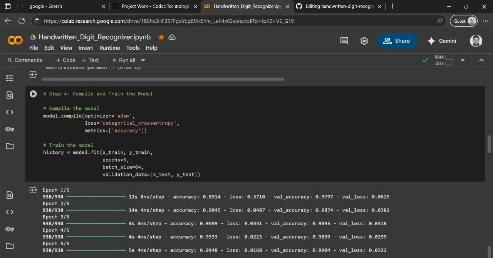

# 🧠 Handwritten Digit Recognizer using CNN & MNIST

This project is a **Convolutional Neural Network (CNN)** based model built to recognize handwritten digits (0–9) using the **MNIST dataset**. The model was trained and tested using **Google Colab**, and saved in `.h5` format.

## 📁 Files Included
- `Handwritten_Digit_Recognizer.ipynb` — Jupyter notebook containing all code (data loading, preprocessing, model training, evaluation).
- `mnist_digit_recognizer.h5` — Trained CNN model saved in HDF5 format.
- `README.md` — Description and overview of the project.

---

## 🔍 Project Overview

### 📌 Objective
To build a machine learning model that accurately classifies handwritten digits from images using a CNN and the MNIST dataset.

### 🧰 Tools & Libraries Used
- Python
- TensorFlow / Keras
- NumPy, Matplotlib
- Google Colab

---

## 📊 Dataset
- **MNIST Dataset** from TensorFlow datasets
- 60,000 training images and 10,000 test images of digits (0–9)
- Each image: 28x28 grayscale

---

## 🧠 Model Architecture
- **Input Layer**: 28x28 grayscale image
- **Conv2D Layer**: 32 filters (3x3) + ReLU
- **MaxPooling2D**
- **Conv2D Layer**: 64 filters (3x3) + ReLU
- **MaxPooling2D**
- **Flatten**
- **Dense Layer**: 128 neurons + ReLU
- **Dropout**: 0.2
- **Output Layer**: 10 neurons (softmax)

---

## 🏁 Training Summary
- **Epochs**: 5  
- **Batch Size**: 64  
- **Final Accuracy**:  
  - Training Accuracy: ~99.4%  
  - Validation Accuracy: ~99.0%  

---

## ✅ How to Use
1. Clone the repo or download the notebook.
2. Open the `.ipynb` file in Google Colab or Jupyter.
3. Run all cells to train or test the model.
4. Or load the `.h5` model for prediction.

```python
from keras.models import load_model
model = load_model('mnist_digit_recognizer.h5')

---

## 📷 Screenshots

### 🧪 Training Output
 *(You can upload a screenshot image and replace this link.)*

---

## 📌 Author
**Vidit Kumar**  
Project completed as part of internship with **Codec Technologies India**.

---

## 🔗 Links
- [Project on Google Colab](https://colab.research.google.com/)
- [Trained Model (.h5)](mnist_digit_recognizer.h5)
